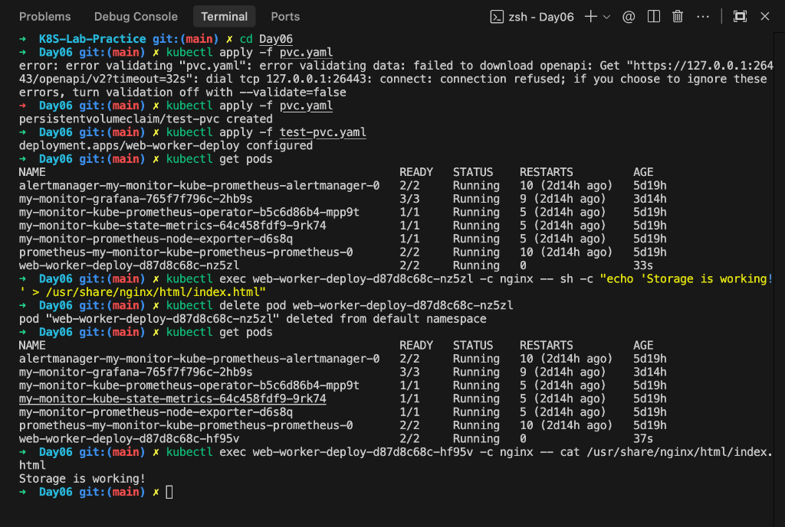

# Day 06: Kubernetes Storage - PV & PVC Explained 💾

Welcome to Day 06! Today I focus on **Persistence**. In Kubernetes, if a Pod dies, its data dies with it by default. To keep my data safe even if the Pod restarts, I use **PV** and **PVC**.

---


## 🛠 How it worked in my Day 06 files

In this folder, I have two main files:

### 1. `pvc.yaml` (The Request)
In this file, I told Kubernetes:
*   **Name:** Call this claim `test-pvc`.
*   **Access Mode:** `ReadWriteOnce` (meaning only one node can read/write to it at a time).
*   **Size:** I want **1Gi** (1 Gigabyte) of space.

```yaml
apiVersion: v1
kind: PersistentVolumeClaim
metadata:
  name: test-pvc
spec:
  accessModes:
    - ReadWriteOnce
  resources:
    requests:
      storage: 1Gi
```

### 2. `test-pvc.yaml` (The Deployment)
This is where I actually **use** that storage in my application.
*   I created a **Volume** named `shop-data`.
*   I told it to use the `claimName: test-pvc` (the application I filed earlier).
*   I **Mounted** it inside my Nginx container at `/usr/share/nginx/html`.

**Result:** Any file I put in `/usr/share/nginx/html` is now saved on that 1GB "Hard Drive" (PV). If the Nginx Pod crashes and a new one starts, the new Pod will connect to the same storage and find all the files still there!

---

## 🚀 Steps I followed

1.  **Define the Claim (`pvc.yaml`):** I asked the cluster for 1GB of storage.
2.  **Submit the Claim:** Kubernetes (if configured with Dynamic Provisioning) automatically created a "Physical House" (PV) for my "Rental Application" (PVC).
3.  **Attach to Pod (`test-pvc.yaml`):** I told my Nginx Deployment to use that specific claim.
4.  **Verification:** My website files are now stored safely in a permanent location instead of inside the temporary container.

---

## 📸 Terminal Output (Verification)
Here is the proof that it works! I created a file, deleted the pod, and when the new pod came up, the file was still there.



---

## 💡 Summary for Beginners
*   **Containers are temporary:** If they go away, everything inside them is deleted.
*   **PV/PVC is permanent:** It’s like an external USB drive that stays plugged in even if you restart your computer.
*   **PVC** is how I ask for it; **PV** is the actual physical disk.

---
