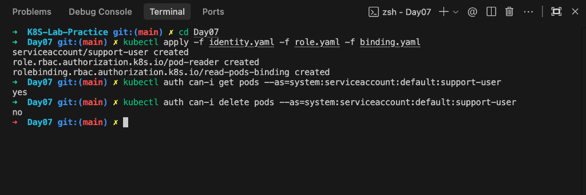

# Day 07: K8s RBAC (Role-Based Access Control)

## Overview
Day 07 focuses on understanding and implementing **Role-Based Access Control (RBAC)** in Kubernetes. RBAC is a method of regulating access to computer or network resources based on the roles of individual users within an enterprise.

In this lab, I created a ServiceAccount, defined a Role with specific permissions, and bound them together using a RoleBinding.

## Manifest Files and Their Functions

### 1. `identity.yaml` (ServiceAccount)
- **Function:** Defines an identity for processes that run in a Pod.
- **Details:** Creates a `ServiceAccount` named `support-user` in the `default` namespace.
- **Purpose:** This acts as the "User" or "Identity" that will be performing actions in the cluster.

### 2. `role.yaml` (Role)
- **Function:** Defines a set of permissions (rules) within a specific namespace.
- **Details:** Creates a `Role` named `pod-reader`.
- **Permissions granted:**
  - **Resources:** `pods`, `pods/log`
  - **Verbs (Actions):** `get`, `list`, `watch`
- **Purpose:** This defines *what* actions are allowed. In this case, it's a read-only role for pods.

### 3. `binding.yaml` (RoleBinding)
- **Function:** Grants the permissions defined in a Role to a user or set of users (Subjects).
- **Details:** Creates a `RoleBinding` named `read-pods-binding`.
- **Subjects:** Points to the `support-user` ServiceAccount.
- **RoleRef:** Points to the `pod-reader` Role.
- **Purpose:** This is the "glue" that connects the **Identity** (`support-user`) to the **Role** (`pod-reader`).

## How They Communicate and Recognize the Role
1. **Identification:** The `ServiceAccount` provides an identity. When a request is made to the Kubernetes API, the API server identifies the requester (in our case, we simulated this using `--as=system:serviceaccount:default:support-user`).
2. **Authorization:** The `RoleBinding` tells the Kubernetes API server: "This specific identity (`support-user`) has the permissions defined in this specific role (`pod-reader`)".
3. **Recognition:** When the `support-user` tries to perform an action (like `get pods`), Kubernetes checks the `RoleBinding` to find the associated `Role`. It then looks at the `Role`'s rules to see if the action and resource are permitted.

## Role Granted for Day 07
The role granted is **Read-Only access to Pods**.
- **Allowed:** `get pods`, `list pods`, `watch pods`, and view logs (`pods/log`).
- **Denied:** Any other action, such as `delete pods`, `create pods`, or accessing other resources like `services` or `deployments`.

## Implementation & Verification Output
Below is the terminal output showing the creation of these resources and the verification of permissions using `kubectl auth can-i`.

From the screenshot:
- `kubectl auth can-i get pods ...` returns **yes** (Authorized).
- `kubectl auth can-i delete pods ...` returns **no** (Unauthorized).
